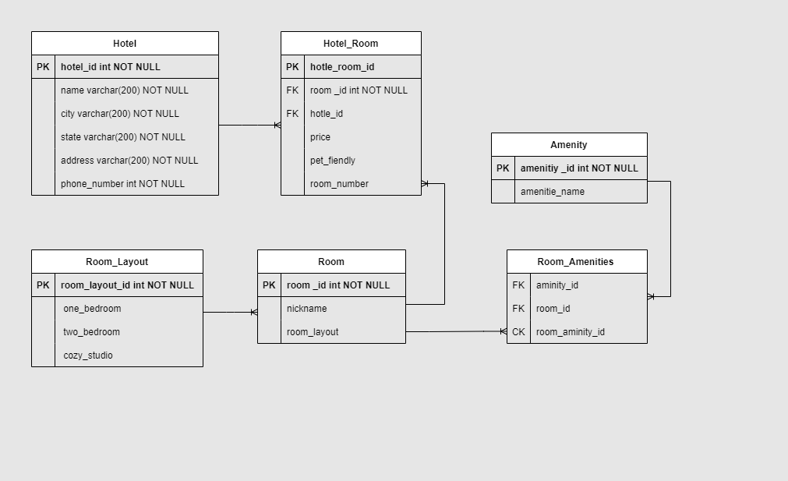
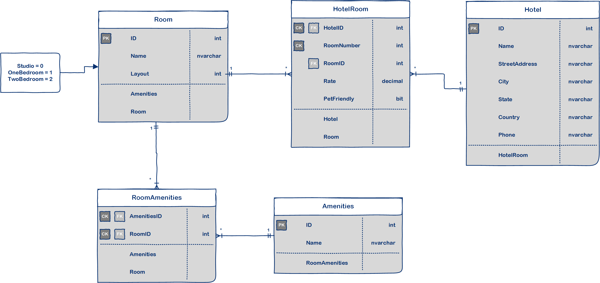
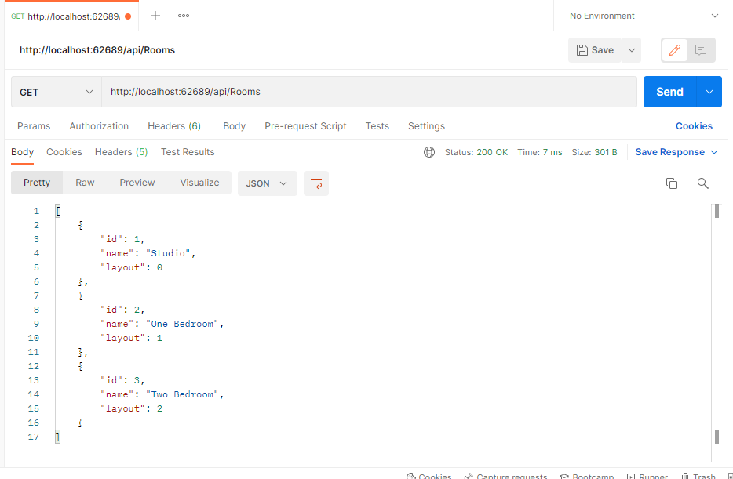
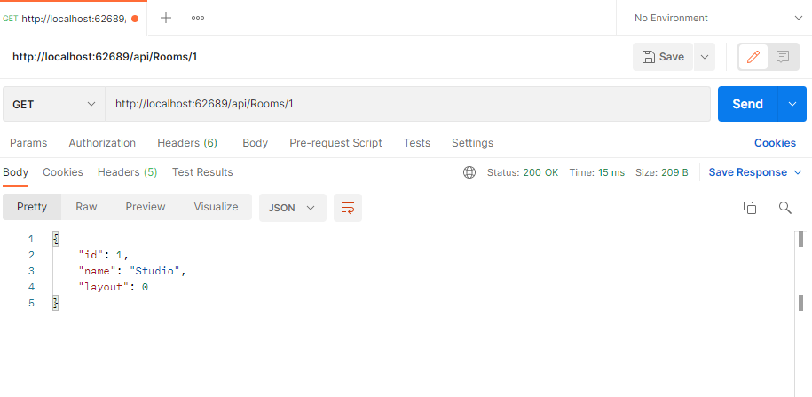
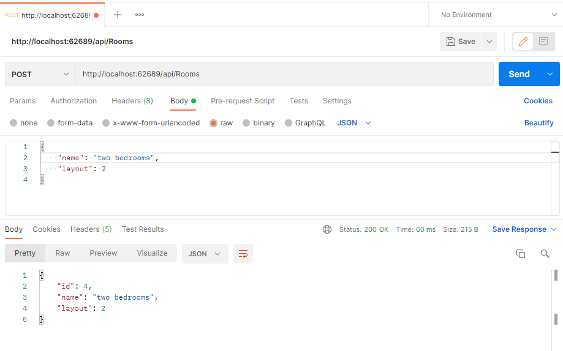
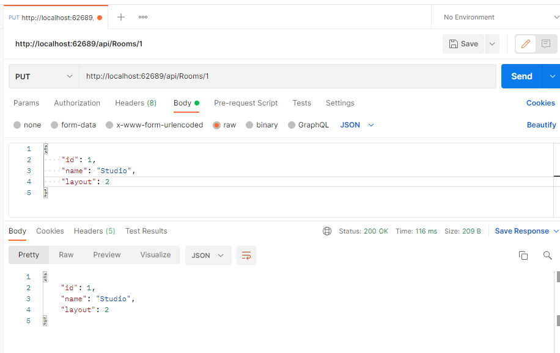
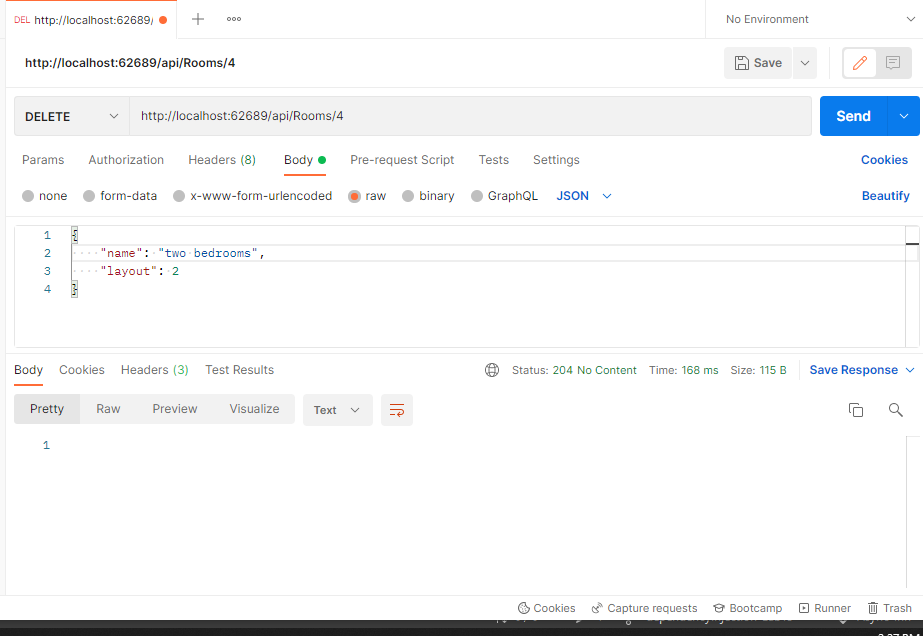

# Async-Inn

#### Islam Alsawaftah / 13-4-2022

#### Amenities Entity

| Route | example data objects that get returned |
| ----------- |----------- |
| GET: api/Amenities | return all amenities |
| GET: api/Amenities/\{id} | return specific amenity |
| PUT: api/Amenities/\{id} | update specific amenity |
| POST: api/Amenities | add new amenity |
| DELETE: api/Amenities/\{id} | delete specific amenity |

#### HotelRooms Entity

| Route | example data objects that get returned |
| ----------- |----------- |
| GET: api/HotelRooms | return all Hotel Rooms |
| GET: api/HotelRooms/\{hotelId}/Rooms/\{roomNumber} | return all room details for a specific room |
| PUT: api/HotelRooms/\{hotelId}/Rooms/\{roomNumber} |  update the details of a specific room |
| POST: api/HotelRooms/\{hotelId}\/Rooms |  to add a room to a hotel |
| DELETE: api/HotelRooms/\{hotelId}\/Rooms/\{roomNumber} | delete a specific room from a hotel |

#### Hotel Entity

| Route | example data objects that get returned |
| ----------- |----------- |
| GET: api/Hotels | return all hotels |
| GET: api/Hotels/\{id} | return specific hotel |
| PUT: api/Hotels/\{id} | update specific hotel |
| POST: api/Hotels | add new hotel |
| DELETE: api/Hotels/\{id} | delete specific hotel |

#### Room Entity

| Route | example data objects that get returned |
| ----------- |----------- |
| GET: api/Rooms | return all rooms |
| GET: api/Rooms/\{id} | return specific room |
| PUT: api/Rooms/\{id} | update specific room |
| POST: api/Rooms | add new room |
| POST: api/Rooms/\{roomId}\/Amenity/\{amenityId} | delete specific aminity from room|
| DELETE: api/Rooms/\{id} | delete specific hotel |
| DELETE: api/Rooms/\{roomId}\/Amenity/\{amenityId} | delete specific aminity from room |

refactor the project to allow and implement dependency injection. keep the current behavior of our API server the same, and only refactoring the architecture.

Dependency Injection (DI) is a software design pattern. It allows us to develop loosely-coupled code. 

#### ERD for web based API for a local hotel asset management system.

#### ERD explanation

* Hotel Table: have a primary key, and it has the fields of name, city, state, address, and phone number. Relationship is (one-to-many) with the join table Hotle_Room, using Hotel primary key.

* Hotel_Room Table: have hotle_room_id as primary key , room _id,hotle_id as foreign keys,  price, pet_fiendly, room_number as payload.
 
* Room Table: have room _id as primary key used in hotel room table as foreign key , and have nickname and layout as fields. Relationship is (one to many) with join table hotel_room and (one to many) with Room_Amenities table.

* The Room Layout Table: have the fields of room_layout_id primary key, one bedroom, two bedroom, cozy studio. Relationship is (one to many) with Room table.

* Aminity Table: have amenitiy _id as primary key and aminity name as filed. Relationship (one to many) with room aminities table

* Room_Amenities Table: have aminity_id from aminity table, room_id from room table as forign keys, and room_aminity_id as composite key generated using foreign keys combined together

#### ERD explanation

* Hotel Table: have an int primary key, and it has the fields of name, city, state, address, and phone number as nvarchar type. Relationship is (one-to-many) with table Hotle_Room.

* HotelRoom Table: have HotelID as int  forign composite key , RoomNumber int composite key,RoomId as int foreign keys,  Rate decimal, pet_fiendly bit.
 
* Room Table: have  Id as primary key int, and have Name nvarchar and layout int as fields. Relationship is (one to many) with table HotelRoom and (one to many) with Room_Amenities table.

* The Room Layout Table: have the fields:  one bedroom, two bedroom, cozy studio. Relationship is (one to many) with Room table.

* Aminities Table: have ID as int primary key and Name nvarchar as filed. Relationship (one to many) with RoomAminities table

* RoomAmenities Table: have AminitiesID int composite forign key, RoomID int composite forign key.

Confirm in POSTMAN

